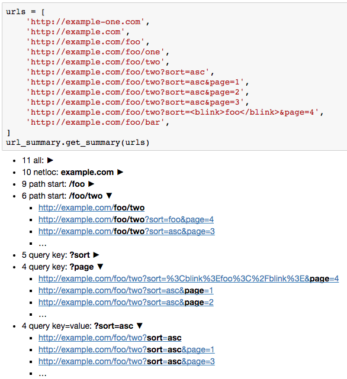

url-summary
===========

.. image:: https://img.shields.io/pypi/v/url-summary.svg
   :target: https://pypi.python.org/pypi/url-summary
   :alt: PyPI Version

Show summary of a large number of URLs in a Jupyter Notebook: analyze domains, paths, query keys and values.
This is useful if you want to have a quick glance at URLs obtained by crawling.

Installation
------------

Install from PyPI::

    pip install url-summary

Usage
-----

::

    import url_summary

    url_summary.get_summary(urls)

Will show as a summary for a given list (or iterable) of urls.
Returned object ``url_summary.UrlSummaryResult``
is a list subclass with a nice Jupyter Notebook display.

License
-------

License is MIT.

